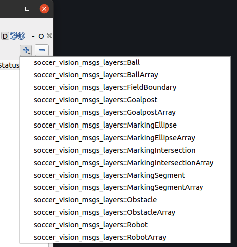

# Soccer Vision Msgs Layers for RQt Image Overlay

[](../../actions/workflows/build_and_test_galactic.yaml)
[](../../actions/workflows/build_and_test_rolling.yaml)

A collection of [RQt Image Overlay](https://rqt-image-overlay.readthedocs.io/en/latest/index.html#) layers for drawing [Soccer Vision Msgs](https://github.com/ros-sports/soccer_interfaces/tree/rolling/soccer_vision_msgs) onto an image.



## ROS Distro

This package works on ROS2 Galactic onwards.

## Installation

[Install RQt Image Overlay](https://rqt-image-overlay.readthedocs.io/en/latest/installation.html#installation) if you haven't installed it yet.

In your ROS2 workspace, clone the repository and its dependencies using:

```
git clone https://github.com/ros-sports/soccer_vision_msgs_layers.git src/soccer_vision_msgs_layers
vcs import src < src/soccer_vision_msgs_layers/dependencies.repos
```

Build the package and its dependencies by running in the workspace root directory:

```
colcon build
```
